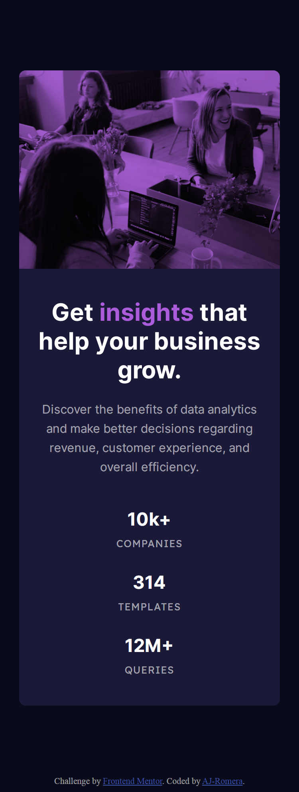

## Table of contents

-   [Overview](#overview)
    -   [The challenge](#the-challenge)
    -   [Screenshot](#screenshot)
    -   [Demo](#demo)
-   [My process](#my-process)
    -   [Built with](#built-with)
-   [Author](#author)

## Overview

### The challenge

This is a challenge from [FrontendMentor](https://www.frontendmentor.io/challenges/stats-preview-card-component-8JqbgoU62). (This is the web if you want to take the challenge or other frontend good challenges)

It consists on building out a card component and get it looking as close to the design as possible, using any tool I like. It has to be responsive (at least mobile and desktop)

### Screenshot

### Demo

-   Under construction...

## My process

### Built with

-   Semantic HTML5 markup
-   Vanilla CSS and CSS Variables
-   Flexbox
-   Mobile-first workflow
-   Love

## Author

-   Linkedin - [AJ-Romera](https://www.linkedin.com/in/aj-romera/)
